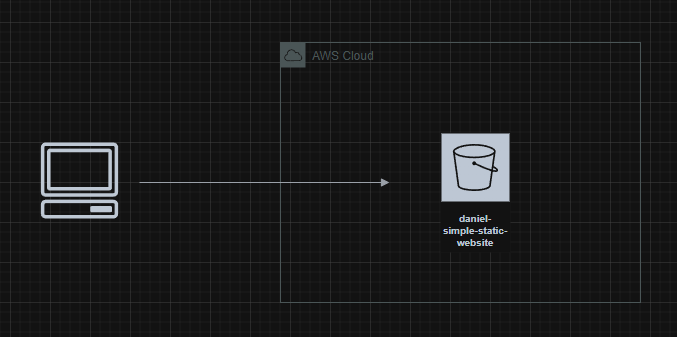

Project Name: S3 Static Website Hosting

Goal:
Learn how to host a simple static website using Amazon S3.

What I Built:
Created an S3 bucket
Enabled static website hosting
Uploaded an index.html file
Made the site publicly accessible
Accessed it through the S3 website endpoint

Architecture:

Steps I Followed:
Created a new S3 bucket
Uploaded website files
Enabled static website hosting
Set permissions to allow public access
Tested access via the S3 URL

What I Learned:
How S3 static hosting works
Basic S3 permissions
Public access settings
How cheap and simple S3 websites are

Possible Improvements:
Add a custom domain with Route 53
Use CloudFront for HTTPS
Add more pages and styling